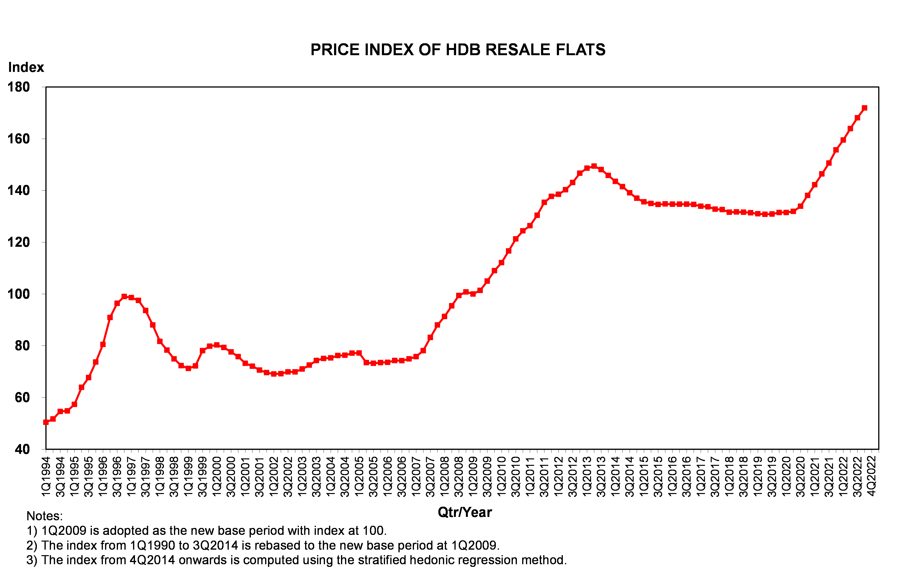
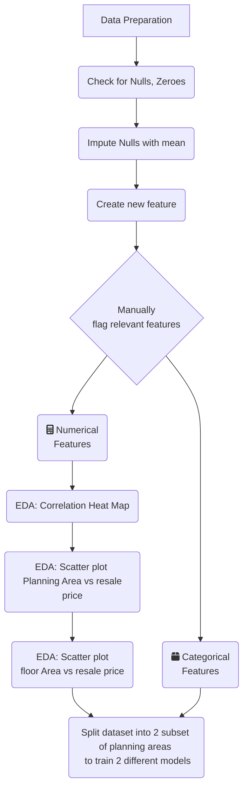
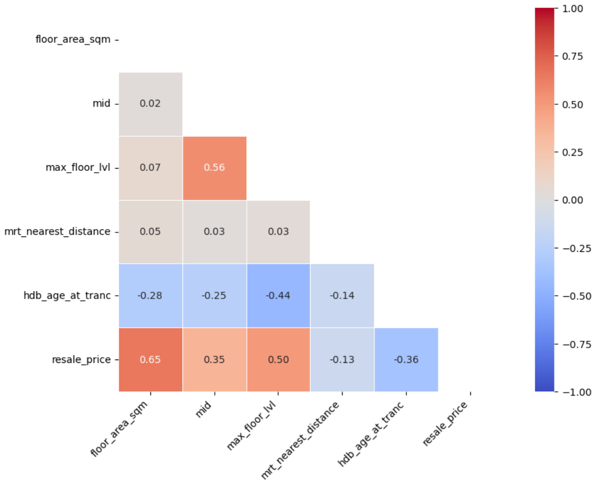
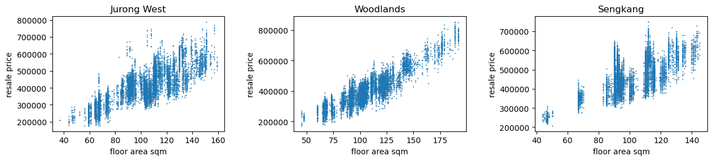
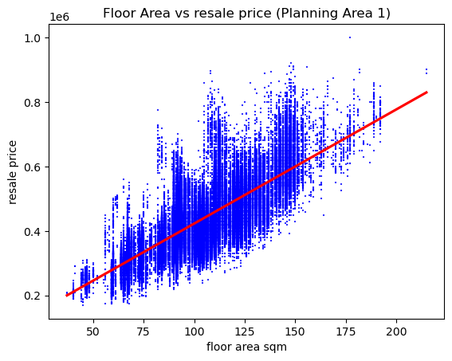
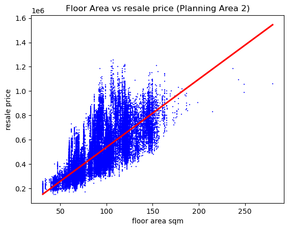
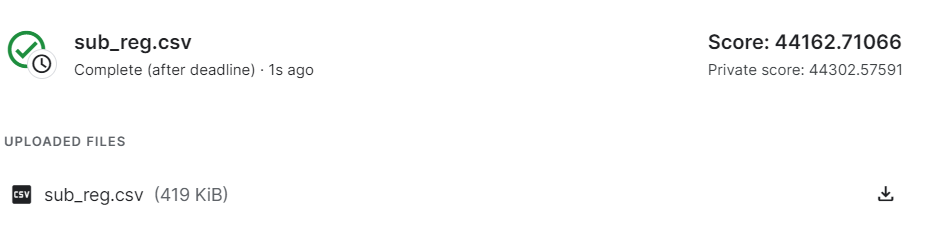

# Project 2: Regression Modelling of HDB resale prices in Singapore

This project aims to apply linear regression techniques on the price of homes at sale for a Singapore public housing dataset from kaggle. [DSI-SG Project 2 Regression Challenge (HDB Price)](https://www.kaggle.com/competitions/dsi-sg-project-2-regression-challenge-hdb-price/overview). 

### Background

Source: [HDB Statistics](https://www.hdb.gov.sg/residential/selling-a-flat/overview/resale-statistics)

There is an upward trend in resale prices, with prices increasing about 2.8 % every quarter for the past 2 years. There is also increasing demand for resale flats driven my factors such as:

1. Lesser waiting time compared to BTO flats
2. Mature estates established infrastructures, amenitites and good accessibility
3. More spacious than BTO flats
4. Increments in resale grants for families buying 4-Room and 5-Room resale flats for the first time
5. Lesser costs on renovation needed
6. More options for location and flat types

Whereas, the downsides are:

1. Higher price than BTO flats
2. Lesser remaining lease

### Problem Statement

With rising demand and prices in resale flats, we attempt on a regression model to based on variables selected from a combination of manual shortlisting and EDA analysis. It serve as an alternative metric to compare with the plethora of pricing tools available online.

### Datasets

#### Training Data 
* [HDB resale prices from 2012 to 2022 Training](./data/train.csv):  

#### Test Data 
* [HDB resale prices from 2012 to 2022 Testing](./data/test.csv):  

#### Test Prediction
* [HDB resale prices from 2012 to 2022 Prediction](./data/sub_reg.csv):  

#### Summary of features and target:

|Feature|Description|Type|
|---|---|---|
|flat_type|type of the resale flat unit e.g. 3 ROOM|Categorical|
|floor_area_sqm|floor area of the resale flat unit in square metres|numerical|
|flat_model|HDB model of the resale flat, e.g. Multi Generation|Categorical|
|Tranc_Year|year of resale transaction|Categorical|
|mid|middle value of storey_range|numerical|
|max_floor_lvl|highest floor of the resale flat|numerical|
|planning_area|Government planning area that the flat is located|Categorical|
|mrt_nearest_distance|distance (in metres) to the nearest MRT station|numerical|
|hdb_age_at_tranc|hdb age during the transaction date|numerical|
|resale_price|price of resale flat|target|

### EDA Overview

### Feature Selection
1. Features with many empty or null values are not selected to train the model.
2. A new HDB age at transaction feature is created as the age during transaction affects the price.
3. 9 features are shortlisted manually based on meaning of the feature and put into either categorical or numerical basket.
4. Correlation of numerical features indicate to use "floor_area_sqm", "hdb_age_at_tranc" and "mid" features are they are more correlated with resale price. "max_floor_level" will be excluded as it is correlated with both selected "hdb_age_at_tranc" and "mid" features at 0.44 and 0.56 respectively. "floor_area_sqm" is most correlated feature with resale price at 0.65.

5. Scatter plot shows more linearity when dataset is grouped by "planning_area"

6. Splitting dataset into 2 subsets, we can see the first dataset is more linearly correlated. Though the second dataset still looks fan-shaped.
* First dataset contains planning areas with lower spread in prices

* Second dataset contains planning areas with higher spread in prices

### Model
* Model 1 for planning areas with lower spread of prices.

|Planning Area |DataSet|
|---|---|
|Hougang                   |1|
|Downtown Core             |1|
|Tampines                  |1|
|Bukit Panjang             |1|
|Jurong West               |1|
|Pasir Ris                 |1|
|Rochor                    |1|
|Sengkang                  |1|
|Yishun                    |1|
|Choa Chu Kang             |1|
|Woodlands                 |1|
|Sembawang                 |1|
|Punggol                   |1|
|Western Water Catchment   |1|
|Changi                    |1|

* Model 1 for planning areas with higher spread in prices.

|Planning Area |DataSet|
|---|---|
|Outram                    |2|
|Queenstown                |2|
|Bukit Merah               |2|
|Toa Payoh                 |2|
|Bukit Timah               |2|
|Novena                    |2|
|Tanglin                   |2|
|Kallang                   |2|
|Geylang                   |2|
|Bishan                    |2|
|Clementi                  |2|
|Serangoon                 |2|
|Jurong East               |2|
|Marine Parade             |2|
|Bedok                     |2|
|Ang Mo Kio                |2|
|Bukit Batok               |2|

Both models go through a pipeline:
1. Numerical features are transformed by StandardScaler
2. Categorical features are one hot encoded
3. Estimator is chosen to be Ridge Regression and the best alpha is selected by gridsearchcv

### Results
Summary of RMSE of both models:
1. The first model is a ridge regression with a better cross validated train and test RMSE score of 37503 ± 194 and 37833.
2. The second model is a ridge regression with a worse cross validated train and test RMSE score of 53092 ± 413 and 53024.

Limitations : 
1. We are not able to predict future (e.g. Next year) resalrre prices are our transaction year is a categorical feature
2. Our features selection is general, and cannot to specific buyers.
3. Macroeconomic and time sensitive variables is not captured in the regression model.
4. The numerical features coefficient cannot be interpreted as the features are transformed by standard scaler.

Conclusions: 
1. Splitting into 2 model allowed one model to more accurately predict resale flat prices in a subset of planning area.
2. Combined model prediction will deviate from actual resale prices around 37K for flats in area 1, and around 53K for flats in area 2.

Submission:

### Additional Exploration 

Additionally using 1 model for each flat type is explored, but the root mean square error is higher.

### Notebooks:

 

---

