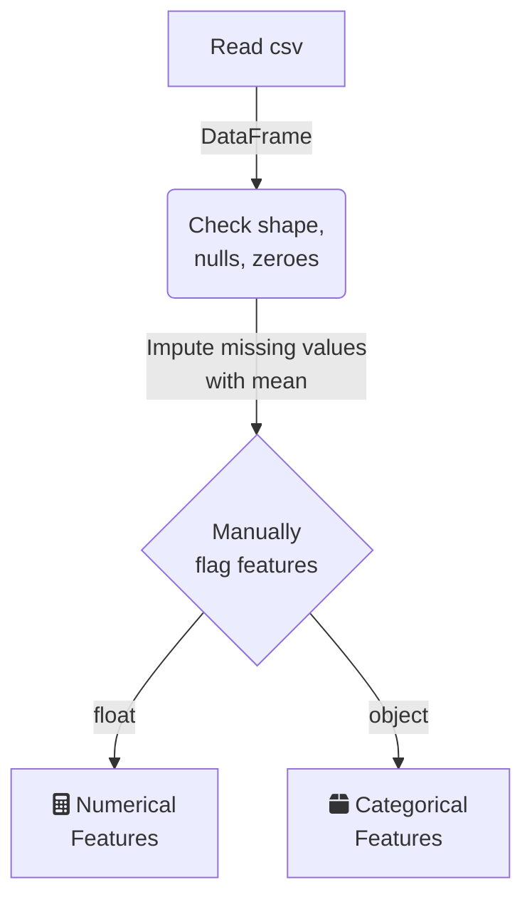

```mermaid
graph TD
    A -->|DataFrame| B
    B -->|Impute missing values <br> with mean| C
    C -->|float| D
    C -->|object| E

    A[Read csv]
    B(Check shape, <br> nulls, zeroes)
    C{Manually <br> flag features}
    D[fa:fa-calculator Numerical <br> Features]
    E[fa:fa-box Categorical <br> Features]
```