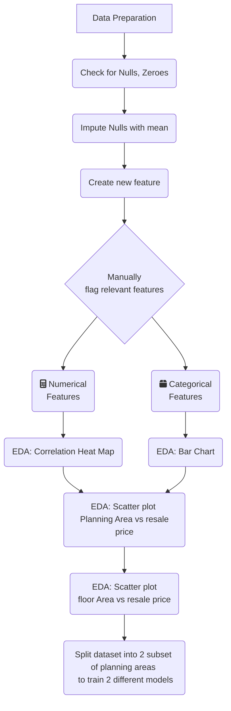

# Project 2: Regression Modelling of HDB resale prices in Singapore

This project aims to apply linear regression techniques on the price of homes at sale for a Singapore public housing dataset from kaggle. [DSI-SG Project 2 Regression Challenge (HDB Price)](https://www.kaggle.com/competitions/dsi-sg-project-2-regression-challenge-hdb-price/overview). 

### Background

There is an upward trend in resale prices, with prices increasing about 2.8 % every quarter for the past 2 years. There is also increasing demand for resale flats driven my factors such as:

1. Lesser waiting time compared to BTO flats
2. Mature estates established infrastructures, amenitites and good accessibility
3. More spacious than BTO flats
4. Increments in resale grants for familieis buying 4-Room and 5-Room resale flats for the first time
5. Lesser costs on renovation needed
6. More options for location and flat types

Whereas, the downsides are:

1. Higher price than BTO flats
2. Lesser remaining lease

### Problem Statement

With rising demand and prices in resale flats, we attempt on a regression model to based on variables selected from a combination of manual shortlisting and EDA analysis. For model prediction, it helps home buyers have a alternative metric to compare against the plethora of pricing tools available online.

### Datasets

#### Training Data 
* [HDB resale prices from 2012 to 2022 Training](./data/train.csv):  

#### Test Data 
* [HDB resale prices from 2012 to 2022 Testing](./data/test.csv):  

#### Kaggle Submission Predictions 
* [HDB resale prices from 2012 to 2022 Prediction](./data/sub_reg.csv):  

The dataset contains the following features:

*resale_price: the property's sale price in Singapore dollars. This is the target variable that you're trying to predict for this challenge.
*Tranc_YearMonth: year and month of the resale transaction, e.g. 2015-02
*town: HDB township where the flat is located, e.g. BUKIT MERAH
*flat_type: type of the resale flat unit, e.g. 3 ROOM
*block: block number of the resale flat, e.g. 454
*street_name: street name where the resale flat resides, e.g. TAMPINES ST 42
*storey_range: floor level (range) of the resale flat unit, e.g. 07 TO 09
*floor_area_sqm: floor area of the resale flat unit in square metres
*flat_model: HDB model of the resale flat, e.g. Multi Generation
*lease_commence_date: commencement year of the flat unit's 99-year lease
*Tranc_Year: year of resale transaction
*Tranc_Month: month of resale transaction
*mid_storey: median value of storey_range
*lower: lower value of storey_range
*upper: upper value of storey_range
*mid: middle value of storey_range
*full_flat_type: combination of flat_type and flat_model
*address: combination of block and street_name
*floor_area_sqft: floor area of the resale flat unit in square feet
*hdb_age: number of years from lease_commence_date to present year
*max_floor_lvl: highest floor of the resale flat
*year_completed: year which construction was completed for resale flat
*residential: boolean value if resale flat has residential units in the same block
*commercial: boolean value if resale flat has commercial units in the same block
*market_hawker: boolean value if resale flat has a market or hawker centre in the same block
*multistorey_carpark: boolean value if resale flat has a multistorey carpark in the same block
*precinct_pavilion: boolean value if resale flat has a pavilion in the same block
*total_dwelling_units: total number of residential dwelling units in the resale flat
*1room_sold: number of 1-room residential units in the resale flat
*2room_sold: number of 2-room residential units in the resale flat
*3room_sold: number of 3-room residential units in the resale flat
*4room_sold: number of 4-room residential units in the resale flat
*5room_sold: number of 5-room residential units in the resale flat
*exec_sold: number of executive type residential units in the resale flat block
*multigen_sold: number of multi-generational type residential units in the resale flat block
*studio_apartment_sold: number of studio apartment type residential units in the resale flat block
*1room_rental: number of 1-room rental residential units in the resale flat block
*2room_rental: number of 2-room rental residential units in the resale flat block
*3room_rental: number of 3-room rental residential units in the resale flat block
*other_room_rental: number of "other" type rental residential units in the resale flat block
*postal: postal code of the resale flat block
*Latitude: Latitude based on postal code
*Longitude: Longitude based on postal code
*planning_area: Government planning area that the flat is located
*Mall_Nearest_Distance: distance (in metres) to the nearest mall
*Mall_Within_500m: number of malls within 500 metres
*Mall_Within_1km: number of malls within 1 kilometre
*Mall_Within_2km: number of malls within 2 kilometres
*Hawker_Nearest_Distance: distance (in metres) to the nearest hawker centre
*Hawker_Within_500m: number of hawker centres within 500 metres
*Hawker_Within_1km: number of hawker centres within 1 kilometre
*Hawker_Within_2km: number of hawker centres within 2 kilometres
*hawker_food_stalls: number of hawker food stalls in the nearest hawker centre
*hawker_market_stalls: number of hawker and market stalls in the nearest hawker centre
*mrt_nearest_distance: distance (in metres) to the nearest MRT station
*mrt_name: name of the nearest MRT station
*bus_interchange: boolean value if the nearest MRT station is also a bus interchange
*mrt_interchange: boolean value if the nearest MRT station is a train interchange station
*mrt_latitude: latitude (in decimal degrees) of the the nearest MRT station
*mrt_longitude: longitude (in decimal degrees) of the nearest MRT station
*bus_stop_nearest_distance: distance (in metres) to the nearest bus stop
*bus_stop_name: name of the nearest bus stop
*bus_stop_latitude: latitude (in decimal degrees) of the the nearest bus stop
*bus_stop_longitude: longitude (in decimal degrees) of the nearest bus stop
*pri_sch_nearest_distance: distance (in metres) to the nearest primary school
*pri_sch_name: name of the nearest primary school
*vacancy: number of vacancies in the nearest primary school
*pri_sch_affiliation: boolean value if the nearest primary school has a secondary school affiliation
*pri_sch_latitude: latitude (in decimal degrees) of the the nearest primary school
*pri_sch_longitude: longitude (in decimal degrees) of the nearest primary school
*sec_sch_nearest_dist: distance (in metres) to the nearest secondary school
*sec_sch_name: name of the nearest secondary school
*cutoff_point: PSLE cutoff point of the nearest secondary school
*affiliation: boolean value if the nearest secondary school has an primary school affiliation
*sec_sch_latitude: latitude (in decimal degrees) of the the nearest secondary school
*sec_sch_longitude: longitude (in decimal degrees) of the nearest secondary school

### EDA Process

Findings:
1. Features with many empty or null values are not selected to train the model.
2. A new HDB age at transaction feature is created as the age during transaction affects the price.
3. 9 features are shortlisted manually based on meaning of the feature and put into either categorical or numerical basket.
4. Correlation of numerical features indicate to use "floor_area_sqm", "hdb_age_at_tranc" and "mid" features are they are more correlated with resale price. "max_floor_level" will be excluded as it is correlated with both selected "hdb_age_at_tranc" and "mid" features at 0.44 and 0.56 respectively. "floor_area_sqm" is most correlated feature with resale price at 0.65.

5. Scatter plot shows more linearity when dataset is grouped by "planning_area"

6. Splitting dataset into 2 subsets, we can see the first dataset is more linearly correlated. Though the second dataset still looks fan-shaped.
* First dataset contains planning areas with lower IQR in prices
* Second dataset contains planning areas with lower IQR in prices

### Model
I am building two models, one for planning areas with lower spread of prices, one for planning areas with higher spread in prices.

Both models go through a pipeline:
1. Numerical features are transformed by StandardScaler
2. Categorical features are one hot encoded
3. Estimator is chosen to be Ridge Regression and the best alpha is selected by gridsearchcv

### Results
* The first model is a ridge regression with a better cross validated train and test RMSE score of 37503 ± 194 and 37833.
* The second model is a ridge regression with a worse cross validated train and test RMSE score of 53092 ± 413 and 53024.

Submission score:

### Additional Exploration 
Additionally I also explored if building 1 model for each flat type. The root mean square error is higher.

### Notebooks:
1.
2.

---

